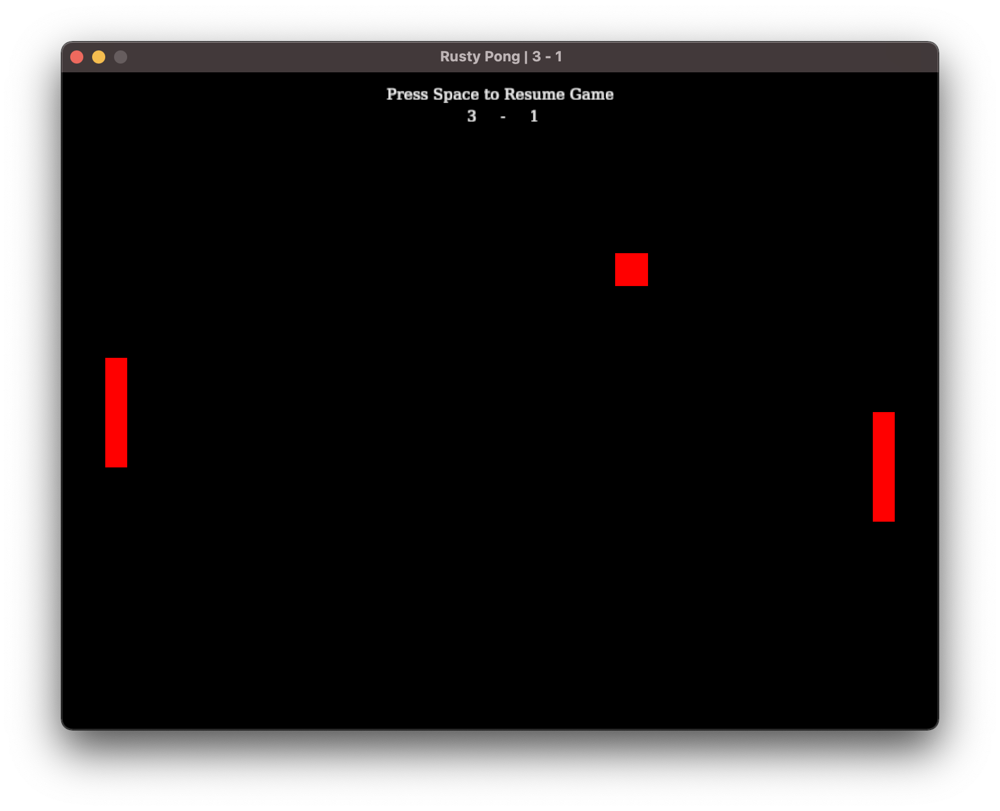
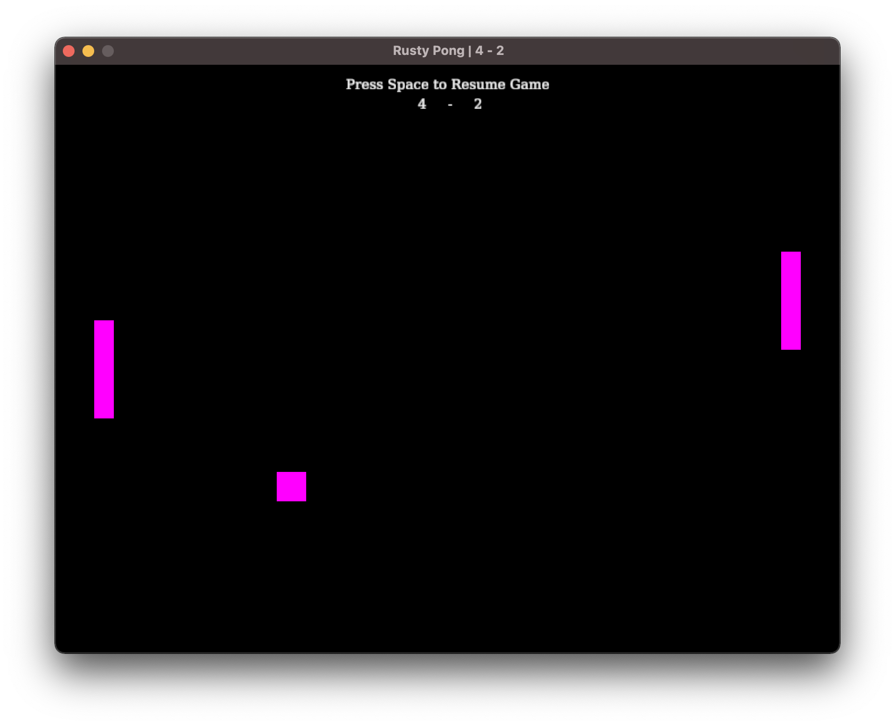

<h1 align="center">Rust Pong Game🏓</h1>

A simple pong game written in rust programing language:



Game controls:

- general:
    - `ESC` - Close the game
    - `Space Bar` - Start or Pause the game
    - `C` - Change game color

- player1:
    - `W` - Move up
    - `S` - Move down
- player2:
    - `Arrow Up` - Move up
    - `Arrow Down` - Move down

<br>

You can randomly change the colors by pressing `C` key:



<hr>

## Running the game
You can <a src="https://github.com/andreprolo/rusty_pong/releases">click here</a> to download the executable for your Windows.

Or, you can <a src="https://www.rust-lang.org/">install rust</a> and simply clone the respository and then execute the code with `cargo run`:

```bash
git clone https://github.com/andreprolo/rusty_pong.git

cd rusty_pong

cargo run
```

<hr>
Feel free to use this code to whatever you want. 😉

<br/><br/>

<i>Author: André Prolo</i>
